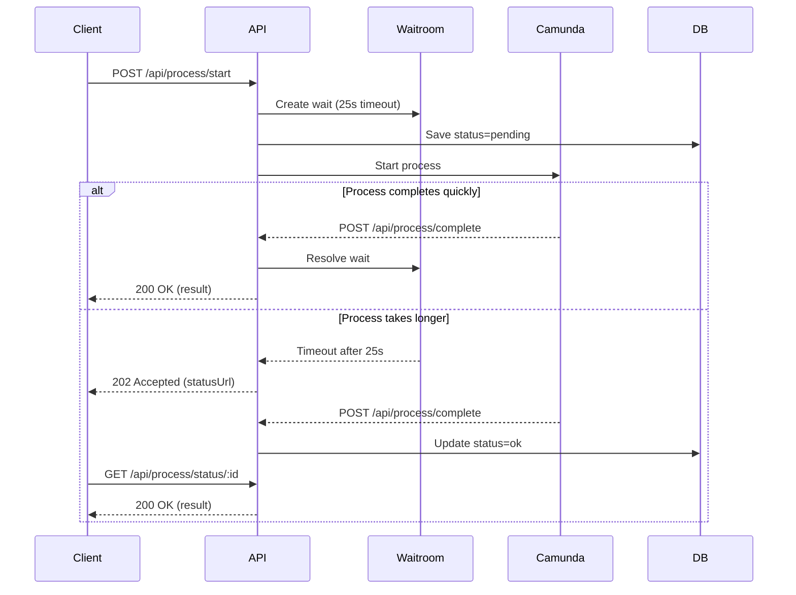

# Understanding the System

This guide explains how fastify-camunda works, the sync/async callback pattern, and key concepts you need to know to work with the system.

## The Problem We Solve

Modern APIs need to handle both quick operations and long-running workflows:

- **Quick operations**: User validates email → return result in 100ms
- **Long workflows**: User onboarding with background checks → takes 30+ seconds

Clients expect consistent API behavior. fastify-camunda provides a unified pattern that handles both cases elegantly.

## The Sync/Async Pattern

### How It Works

When a client starts a process:

1. **Immediate wait**: The API waits up to a timeout (default 25 seconds)
2. **If completed within timeout**: Return 200 with results immediately
3. **If timeout expires**: Return 202 with a status URL for polling
4. **Client can poll**: Check status URL until process completes

This gives you the best of both worlds:

- Fast processes feel synchronous and responsive
- Slow processes don't block or timeout the client

### Visual Flow



See [docs/diagrams/callback-flow.mermaid](../diagrams/callback-flow.mermaid) for the full diagram.

## Key Concepts

### Correlation ID

A unique identifier that tracks a process from start to finish.

- **Client provides**: The correlation ID in the start request
- **System tracks**: All steps reference this ID
- **Used for**: Status polling, event logging, waitroom tracking

Example:

```json
{
  "processKey": "onboard-user",
  "correlationId": "user-123-2025-10-28",
  "variables": { "userId": "user-123" }
}
```

Best practices:

- Make IDs unique and meaningful
- Include timestamps if repeating processes
- Use business identifiers when available (order ID, user ID, etc.)

### Process Key

Identifies which workflow to execute. Each process has a unique key matching its Camunda BPMN definition.

Examples:

- `onboard-user`: User onboarding workflow
- `process-payment`: Payment processing workflow
- `generate-report`: Report generation workflow

The process key must match:

1. The key in your BPMN diagram
2. The process definition in `src/camunda/processes/<process-key>/`

### Topics and Handlers

Camunda processes are broken into tasks. Each task has a topic that a worker subscribes to.

**Topic**: A named queue for external tasks
**Handler**: Code that executes when a task from that topic is fetched

Example from onboard-user:

```typescript
// Topic: "onboard-user.validate-user-information"
// Handler: src/camunda/processes/onboard-user/topics/validate-user-information/handler.ts
```

Flow:

1. Camunda creates a task with topic `onboard-user.validate-user-information`
2. Worker polls Camunda and fetches the task
3. Handler executes business logic
4. Handler completes task with result or error
5. Camunda moves to next step

### Waitroom

The waitroom is an in-memory Map that tracks promises for pending processes.

When you call `createWait(correlationId, 25000)`:

- A Promise is created and stored in the Map
- A timeout is set for 25 seconds
- The Promise waits for `completeWait()` or `failWait()` to be called

When the process completes:

- `completeWait(correlationId, result)` is called
- The Promise resolves with the result
- The waiting client receives the response
- The entry is removed from the Map

See [../reference/core-libraries.md](../reference/core-libraries.md#waitroom) for API details.

### Process Store

The process store maintains the state of all processes in two places:

1. **In-memory Map**: Fast access, cleared on restart
2. **Database table**: Persistent storage, survives restarts

Operations:

- `save()`: Update in-memory Map immediately, write to DB async
- `get()`: Read from in-memory Map if available, fallback to DB
- `remove()`: Delete from Map, DB row stays for audit

This design prioritizes speed while ensuring durability.

## Process Lifecycle

A complete process flows through these states:

### 1. Start

Client calls `POST /api/process/start`:

```bash
POST /api/process/start
{
  "processKey": "onboard-user",
  "correlationId": "user-123",
  "variables": { "userId": "user-123" }
}
```

System actions:

- Validate request
- Generate execution context IDs (batch_id, traceability_id, application_id)
- Save initial status (`pending`) to process store
- Create wait in waitroom
- Call Camunda REST API to start process
- Wait for completion or timeout

### 2. Execute

Camunda executes tasks in sequence:

For each task:

1. Camunda creates external task with topic
2. Worker fetches task
3. Handler extracts variables (using `readVars`)
4. Service executes business logic
5. Handler completes task (using `completeWith`)
6. Event is logged to database
7. Camunda proceeds to next task

Example task execution:

```typescript
// Handler receives task
const vars = readVars(task, schema); // Extract and validate variables
const result = await service(vars); // Execute business logic
completeWith(task, result); // Return result to Camunda
await logEvent(correlationId, step, "ok", result); // Audit trail
```

### 3. Complete

Final task calls `POST /api/process/complete`:

```json
{
  "correlationId": "user-123",
  "status": "ok",
  "data": { "success": true, "results": [...] }
}
```

System actions:

- Update process store with final status and data
- Call `completeWait()` to wake any waiting clients
- Schedule removal from in-memory Map (after 5 seconds)
- Return 200 to Camunda

### 4. Retrieve (if async)

If the process timed out, client polls:

```bash
GET /api/process/status/user-123
```

Returns current status:

- **200**: Completed successfully (`status: "ok"`)
- **202**: Still running (`status: "pending"`)
- **500**: Failed (`status: "error"`)
- **404**: Not found (never existed or cleaned up)

## Event Logging

Every step is logged to the `event_log` table:

```sql
INSERT INTO event_log (
  correlation_id,
  step_name,
  status,
  http_method,
  endpoint,
  request_data,
  response_data,
  error_message
) VALUES (...)
```

This creates a complete audit trail:

- What happened at each step
- When it happened
- What data was sent/received
- Any errors encountered

Query all events for a process:

```sql
SELECT * FROM event_log
WHERE correlation_id = 'user-123'
ORDER BY created_at;
```

## Variables and Data Flow

Variables flow through the process:

### Initial Variables

Client provides in start request:

```json
{
  "variables": {
    "userId": "user-123",
    "email": "user@example.com"
  }
}
```

### System Variables

Added automatically:

- `correlationId`: Process identifier
- `batch_id`: Batch identifier (UUID)
- `traceability_id`: Tracing identifier (UUID)
- `application_id`: Application identifier (UUID)
- `identifiers`: JSON object with applicationId

### Step Variables

Each step can:

- Read variables from previous steps
- Add new variables
- Update existing variables

Variables are passed in Camunda format:

```typescript
{
  variableName: {
    value: "actual value",
    type: "String" | "Integer" | "Boolean" | "Json"
  }
}
```

### Final Result

Aggregated in prepare-response step:

```json
{
  "validationResult": { "valid": true },
  "backgroundCheckResult": { "cleared": true },
  "onboardingResult": { "success": true, "userId": "user-123" }
}
```

## Error Handling

Errors can occur at any step. The system handles them gracefully:

### Business Rule Errors

Expected errors (validation failures, business rule violations):

```typescript
import { BusinessRuleError } from "../../../lib/errors";

if (!isValidEmail(email)) {
  throw new BusinessRuleError("Invalid email format", { email });
}
```

These are logged and can trigger error handling workflows.

### Technical Errors

Unexpected errors (network failures, database errors):

```typescript
try {
  const result = await externalAPI.call(data);
} catch (err) {
  // Log and re-throw
  logger.error({ err }, "API call failed");
  throw err;
}
```

### Error Propagation

When a step fails:

1. Handler catches error
2. Event log records failure
3. Handler calls `task.error()` or BPMN error
4. Camunda routes to error handling path (if defined)
5. Process store updated with error status
6. Client receives error response or error in status polling

See [../reference/error-handling.md](../reference/error-handling.md) for details.

## Architecture Components

### Fastify Server

- Routes auto-loaded from `src/routes/`
- Plugins register shared services (database, logger, etc.)
- Decorated with `app.processStore`, `app.eventLog`, etc.

### Camunda Client

- Connects to Camunda REST API
- Polls for external tasks
- Routes tasks to registered handlers
- Manages task locking and completion

### In-Memory Structures

- **Waitroom Map**: Pending promises for waiting clients
- **Process Store Map**: Current process states

### Database

- **event_log**: Audit trail of all steps
- **process_store**: Persistent process state
- Other tables for business data (users, etc.)

## Performance Considerations

### Why In-Memory First?

Reading from a Map is ~100x faster than a database query:

- Map: ~0.01ms
- Database: ~1-10ms

For status checks while waiting, speed matters.

### When Does Database Matter?

- Server restarts: In-memory Map is lost, database has state
- Multiple instances: Future Redis integration for shared state
- Audit trail: Event log provides complete history

### Cleanup

Completed processes are removed from in-memory Map after 5 seconds:

- Allows final status check
- Prevents memory growth
- Database retains historical data

## Next Steps

Now that you understand how the system works:

1. **[Creating a Process](creating-a-process.md)**: Build your first workflow
2. **[Testing Guide](testing-guide.md)**: Test your processes
3. **[Architecture Overview](../design/architecture-overview.md)**: Dive deeper into design
4. **[Callback Strategy](../design/callback-strategy.md)**: Implementation details
